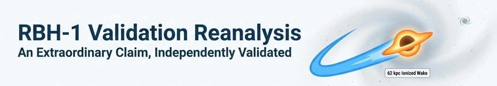
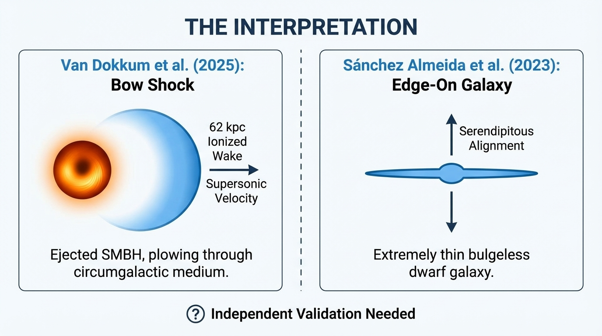
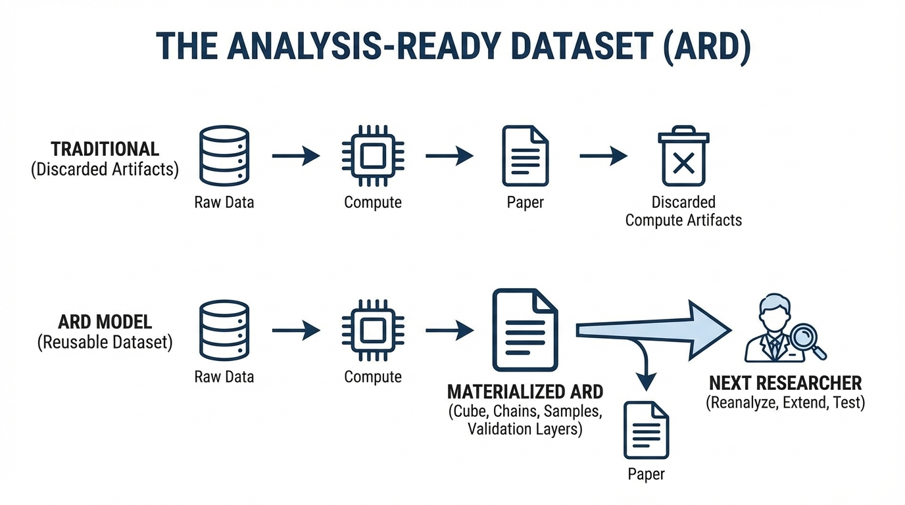
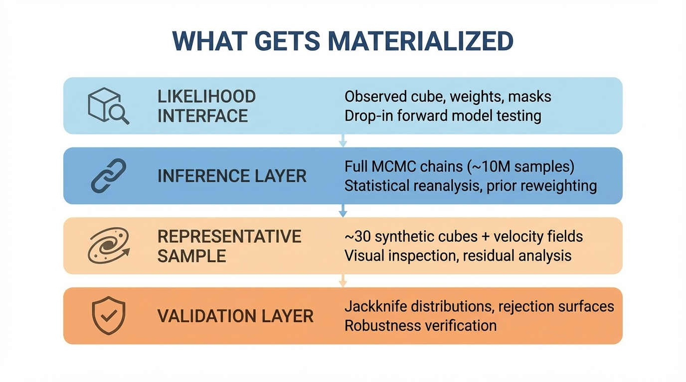
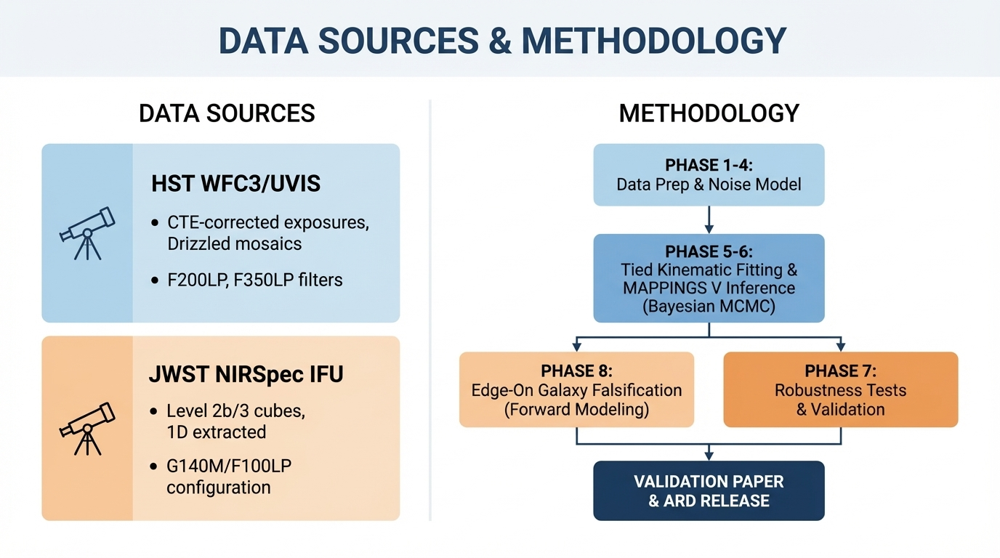

# 🔭 RBH-1 Validation & Reanalysis

> Independent validation of the RBH-1 hypervelocity SMBH candidate — testing whether the 62 kpc supersonic bow shock interpretation survives expanded methodological freedom.

[](https://github.com/radioastronomyio/rbh1-validation-reanalysis)
[](https://archive.stsci.edu/proposal_search.php?id=17301)
[](https://www.stsci.edu/jwst/science-execution/program-information?id=3149)
[](https://www.python.org/)
[](LICENSE)



RBH-1 Validation & Reanalysis is an independent validation study of the extraordinary RBH-1 linear feature (van Dokkum et al. 2025), interpreted as a 62 kpc supersonic bow shock from a hypervelocity supermassive black hole ejected at ~1000 km/s. This project contributes open tools, reproducible methods, and a complete Analysis-Ready Dataset (ARD) to the community discussion around this remarkable object.

---

## 🎯 Quick Start

### For Researchers

- [📖 Validation Methodology](docs/README.md) - Complete methodology documentation
- [📊 Data Sources](#-data-sources) - HST and JWST observation details
- [🔬 Validation Criteria](#validation-criteria) - What "validation" means for this project

### For Developers

- [🏗️ Repository Structure](#-repository-structure) - Navigate the codebase
- [💻 Scripts](scripts/README.md) - Phase-organized execution scripts
- [📦 Source Code](src/README.md) - Reusable library modules

### For Validators

- [📝 Work Logs](work-logs/README.md) - Complete development history
- [✅ Validation Outputs](validation/README.md) - Data integrity and QA results
- [📓 Notebooks](notebooks/README.md) - Exploratory analysis

---

## 🌟 Project Overview

RBH-1 represents one of the most extraordinary astronomical claims in recent years: a supermassive black hole ejected from its host galaxy, now plowing through the circumgalactic medium at supersonic velocities and leaving a 62 kiloparsec ionized wake. If confirmed, this would be the first direct observation of gravitational wave recoil in action.

This project provides independent validation through two inseparable deliverables:

| Deliverable | Description |
|-------------|-------------|
| Validation Paper | Bayesian reanalysis testing whether the bow shock interpretation survives expanded methodological freedom |
| Analysis-Ready Dataset | Complete ARD on Zenodo enabling community reanalysis without climbing the compute wall |

### Why This Project Exists

Our team has a deep interest in extreme objects. Contributing to the scientific discussion around RBH-1—through open methods, transparent analysis, and reusable data products—is not just scientifically valuable, it's an honor. We approach this as neutral validation: either strengthening the extraordinary claim or identifying where additional work is needed. Both outcomes advance the field.

---

## 🔬 Scientific Context

### The Object

RBH-1 is a highly linear feature extending ~62 kpc from a compact source at redshift z ≈ 0.96. JWST NIRSpec IFU spectroscopy reveals:

- Kinematic discontinuity: ~600 km/s velocity change across ~1 kpc at the "tip"
- Shock-consistent line ratios: Emission diagnostics matching fast radiative shock models
- Surface brightness truncation: Factor >40× intensity drop at the tip over one resolution element

### The Interpretation



Van Dokkum et al. (2025) interpret these observations as a supersonic bow shock from an ejected SMBH. The competing "edge-on galaxy" hypothesis (Sánchez Almeida et al. 2023) proposes the feature is a serendipitously aligned, extremely thin bulgeless dwarf galaxy.

### Our Approach

We validate the bow shock interpretation through:

1. Expanded Bayesian inference on shock parameters with proper marginalization
2. Stress-testing the background subtraction methodology
3. Quantitative falsification of the edge-on galaxy alternative through forward modeling

### Validation Criteria

Confirmation conditions — the interpretation is validated if:

- 95% CI of shock velocity from line ratios overlaps spatial gradient measurement
- Difference-of-pointings artifacts account for <20% of wake flux
- Inferred metallicity consistent with CGM (Z < 0.5 Z☉)
- Velocity discontinuity persists across all jackknife subsets

Tension conditions — tension is declared if:

- Marginalizing over magnetic parameter broadens v_s posterior to include virial velocities
- Standard Level 3 extraction significantly diminishes wake signal
- Jackknife analysis shows exposure/region dependence

---

## 📦 The Analysis-Ready Dataset

### Compute Artifacts as Deliverables

Astronomical reanalysis has a hidden cost: the weeks of CPU time between downloading calibrated data and having usable posteriors. Every researcher who wants to revisit a result faces this compute wall, often regenerating artifacts that previous researchers already produced and discarded. This is institutionalized waste.

So, we're keeping our dataset, and we're sharing it.

The effort to package computed artifacts—chains, synthetic cubes, likelihood interfaces—is negligible compared to the effort to generate them. If sharing them saves even one researcher from repeating weeks of work, the cost-benefit is obvious.

This isn't a methodology innovation. It's just not throwing away what we already computed.



### What Gets Materialized



| Layer | Contents | Purpose |
|-------|----------|---------|
| Likelihood Interface | Observed cube, weights, masks, instrument kernels | Drop-in forward model testing |
| Inference Layer | Full MCMC chains (~10M samples) | Statistical reanalysis, prior reweighting |
| Representative Sample | ~30 synthetic cubes + intrinsic velocity fields | Visual inspection, residual analysis |
| Validation Layer | Jackknife distributions, rejection surfaces | Robustness verification |

### What This Enables

A researcher receiving the RBH-1 ARD can:

- Skip weeks of compute — Posterior samples already exist
- Test alternative priors — Reweight existing chains instead of rerunning
- Run their own forward model — Likelihood interface provides the contract
- Validate against new data — Future observations plug directly in
- Reproduce exactly — Full provenance chain from MAST to final measurement

---

## 📊 Data Sources



### HST WFC3/UVIS (Program GO-17301)

| Product | Type | Purpose |
|---------|------|---------|
| `*_flc.fits` | CTE-corrected exposures | Custom error analysis |
| `*_drc.fits` | Drizzled mosaics | Astrometric alignment |

Filters: F200LP (~15ks), F350LP (~15ks) — 6 visits, 146 products, ~44 GB

### JWST NIRSpec IFU (Program GO-3149)

| Product | Type | Purpose |
|---------|------|---------|
| `*_cal.fits` | Level 2b calibrated | Sensitivity testing |
| `*_s3d.fits` | Level 3 cubes | Primary extraction |
| `*_x1d.fits` | 1D extracted | Sanity checks |

Configuration: G140M/F100LP, ~7ks total — 52 products, ~5 GB

### MAPPINGS V Shock Models

Pre-computed grids from 3MdB database for radiative shock parameter inference.

---

## 🏗️ Repository Structure

```
rbh1-validation-reanalysis/
├── 🎨 assets/                      # Hero images and diagrams
├── 💾 data/                        # Data manifest and staging
│   ├── 01_raw/                     # Raw observation pointers
│   ├── 02_reduced/                 # Extracted spectra
│   ├── 03_inference/               # MCMC outputs
│   └── 04_ard/                     # ARD package staging
├── 📚 docs/                        # Methodology documentation
│   └── documentation-standards/    # Templates and conventions
├── 📓 notebooks/                   # Exploratory analysis
├── 📦 rbh1-ard-v1/                # ARD release package
├── 💻 scripts/                     # Phase-organized execution
│   ├── 00-ideation-and-setup/
│   ├── 01-data-acquisition/
│   ├── 02-standard-extraction/
│   ├── 03-cube-differencing/
│   ├── 04-noise-model/
│   ├── 05-kinematic-fitting/
│   ├── 06-mappings-inference/
│   ├── 07-robustness-tests/
│   ├── 08-galaxy-falsification/
│   └── 09-ard-materialization/
├── 🔧 src/                         # Reusable library code
│   ├── extraction/                 # Spectral extraction pipeline
│   ├── inference/                  # MCMC and likelihood
│   ├── falsification/              # Galaxy hypothesis testing
│   └── visualization/              # Figure generation
├── ✅ validation/                  # Data validation outputs
└── 📝 work-logs/                   # Phase documentation
    ├── 00-ideation-and-setup/
    ├── 01-data-acquisition/
    └── ...
```

### Navigation Guide

| Directory | Purpose | README |
|-----------|---------|--------|
| `assets/` | Hero images and diagrams | — |
| `data/` | Data manifest and staging areas | [README](data/README.md) |
| `docs/` | Methodology and specifications | [README](docs/README.md) |
| `notebooks/` | Exploratory Jupyter analysis | [README](notebooks/README.md) |
| `rbh1-ard-v1/` | ARD release package | [README](rbh1-ard-v1/README.md) |
| `scripts/` | Phase-organized execution scripts | [README](scripts/README.md) |
| `src/` | Reusable library modules | [README](src/README.md) |
| `validation/` | Data integrity and QA outputs | [README](validation/README.md) |
| `work-logs/` | Phase worklogs and development history | [README](work-logs/README.md) |

---

## 🖥️ Compute Infrastructure

This project uses dedicated VMs from the Proxmox Astronomy Lab cluster.

### Allocated Resources

| Node | CPU | RAM | GPU | Role |
|------|-----|-----|-----|------|
| proj-gpu01 | AMD 5950X (16c) | 48 GB | NVIDIA A4000 16GB | GPU inference, task broker |
| proj-cpu01 | Intel 12900K (12c) | 48 GB | — | MCMC walker pool |
| proj-cpu02 | Intel 12900K (12c) | 48 GB | — | MCMC walker pool |
| proj-cpu03 | Intel 12900K (12c) | 48 GB | — | MCMC walker pool |

### Pipeline Architecture

The falsification campaign uses a Producer-Consumer pattern optimized for heterogeneous hardware:

- CPU Nodes (Producers): Propose parameters, compute galactic dynamics via `galpy`, apply Toomre Q stability filter
- GPU Node (Consumer): JAX-based 3D cube generation, PSF/LSF convolution, likelihood evaluation
- DragonFlyDB: High-throughput task broker (ephemeral)
- PostgreSQL: ACID-compliant chain storage (durable)

---

## 🏆 Project Status

| Phase | Description | Status |
|-------|-------------|--------|
| Phase 0 | Ideation and Setup | ✅ Complete |
| Phase 1 | Data Acquisition + Validation | ✅ Complete |
| Phase 2 | Standard Extraction Baseline | ⏳ Pending |
| Phase 3 | Cube-Space Differencing | ⏳ Pending |
| Phase 4 | Empirical Noise Model | ⏳ Pending |
| Phase 5 | Tied Kinematic Fitting | ⏳ Pending |
| Phase 6 | MAPPINGS V Inference | ⏳ Pending |
| Phase 7 | Robustness Tests | ⏳ Pending |
| Phase 8 | Edge-on Galaxy Falsification | ⏳ Pending |
| ARD | Dataset Materialization | ⏳ Pending |

**Current Milestone:** Phase 01 complete. HST and JWST data acquired (198 files, ~45 GB), validated against van Dokkum et al. (2025) claims, and QA visualizations generated. All validation checks pass. See [Phase 01 Worklog](work-logs/01-data-acquisition/README.md) for details.

**Next:** Phase 02 — Standard extraction baseline from JWST S3D cubes and HST DRC photometry.

**ARD Target:** v1.0 release alongside paper submission

---

## 🔗 Related Projects

This project is part of the [radioastronomyio](https://github.com/radioastronomyio) research program:

| Project | Description |
|---------|-------------|
| [proxmox-astronomy-lab](https://github.com/radioastronomyio/proxmox-astronomy-lab) | Platform documentation, VM inventory, network architecture |
| [desi-cosmic-void-galaxies](https://github.com/radioastronomyio/desi-cosmic-void-galaxies) | Galaxy populations in cosmic voids using DESI DR1 |
| [desi-quasar-outflows](https://github.com/radioastronomyio/desi-quasar-outflows) | AGN outflow spectral fitting and Cloudy modeling |
| [desi-qso-anomaly-detection](https://github.com/radioastronomyio/desi-qso-anomaly-detection) | ML anomaly detection for quasar spectra |

### External Resources

| Resource | Link |
|----------|------|
| van Dokkum et al. (2025) | [arXiv preprint](https://arxiv.org/) |
| HST GO-17301 | [MAST Archive](https://archive.stsci.edu/) |
| JWST GO-3149 | [MAST Archive](https://archive.stsci.edu/) |
| MAPPINGS V | [3MdB Database](https://3mdb.astro.unam.mx/) |

---

## 🌟 Open Science Commitment

This project is committed to full transparency and reproducibility:

| Artifact | Platform | Contents |
|----------|----------|----------|
| Code | GitHub | All analysis scripts, pipeline code |
| Work Logs | GitHub | Decision documentation, methodology notes |
| ARD | Zenodo | Complete Analysis-Ready Dataset with DOI |
| Paper | arXiv | Preprint with full methodology |

The ARD will include everything needed to reproduce our results or test alternative hypotheses without access to HPC resources.

---

## 🤝 Contributing

This project implements systematic AI-human collaboration through transparent documentation and open science practices.

### Development Principles

| Principle | Implementation |
|-----------|----------------|
| Documentation First | All methodology documented before execution |
| Reproducibility | Full provenance chain, versioned artifacts |
| Open Science | Code, logs, and data publicly released |
| Neutral Stance | Validation, not advocacy |

### Getting Started

1. Review the [Validation Specification](docs/README.md)
2. Check the [Work Logs](work-logs/README.md) for current status
3. See phase-specific READMEs for implementation details

---

## 📜 License

This project is licensed under the MIT License — see the [LICENSE](LICENSE) file for details.

---

## 🙏 Acknowledgments

### Scientific Foundation

- van Dokkum et al. — Original RBH-1 discovery and interpretation
- STScI/MAST — HST and JWST data archive
- MAPPINGS V Team — Shock model grids

### Infrastructure

- Proxmox Astronomy Lab — Compute cluster
- JAX/Google — GPU-accelerated inference
- ArviZ — Bayesian analysis ecosystem

---

*Contributing to the discussion of extraordinary objects | Part of [radioastronomyio](https://github.com/radioastronomyio)*

Last Updated: December 23, 2025 | Current Phase: Phase 02 — Standard Extraction
