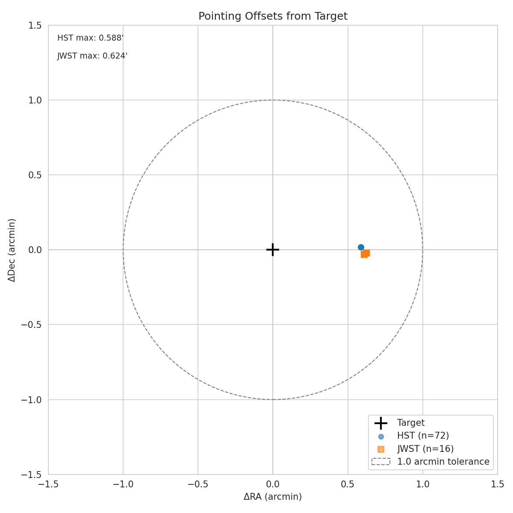
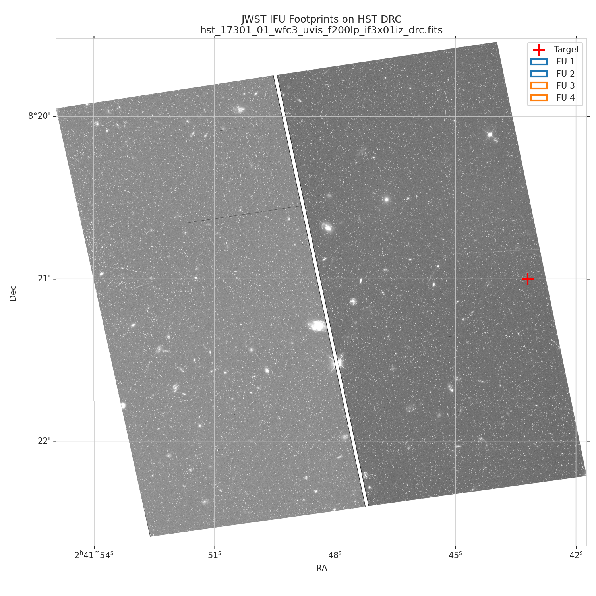
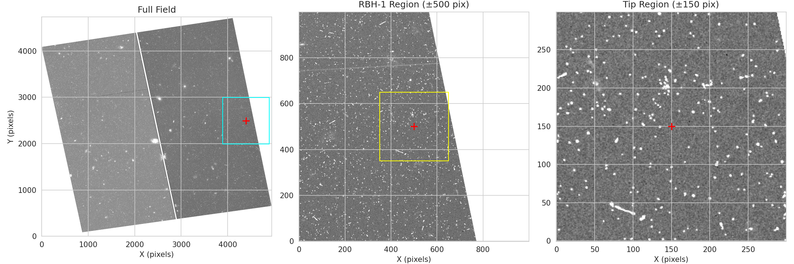
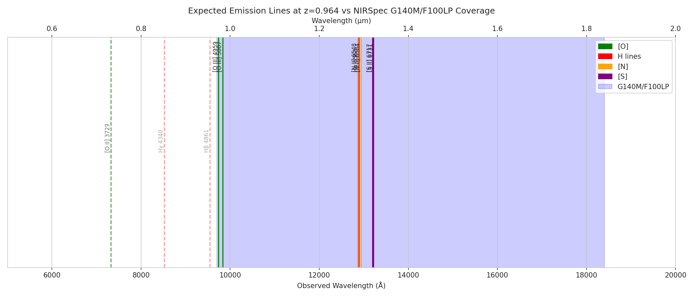
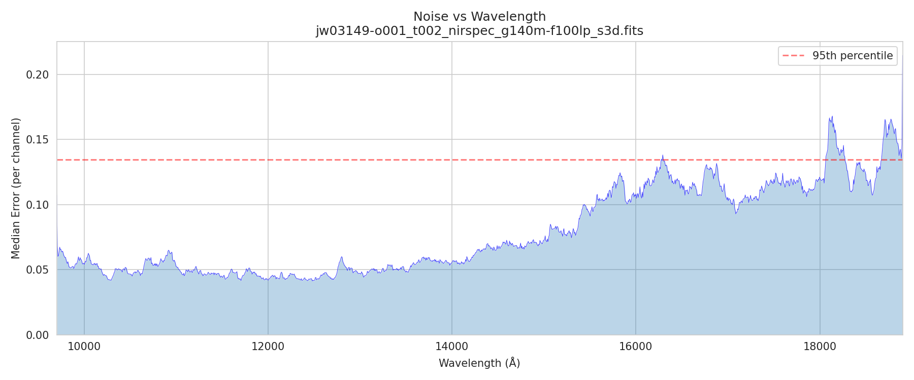
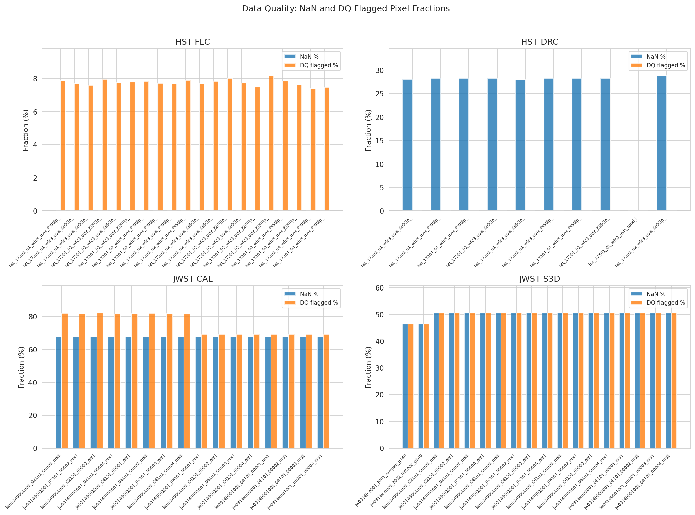
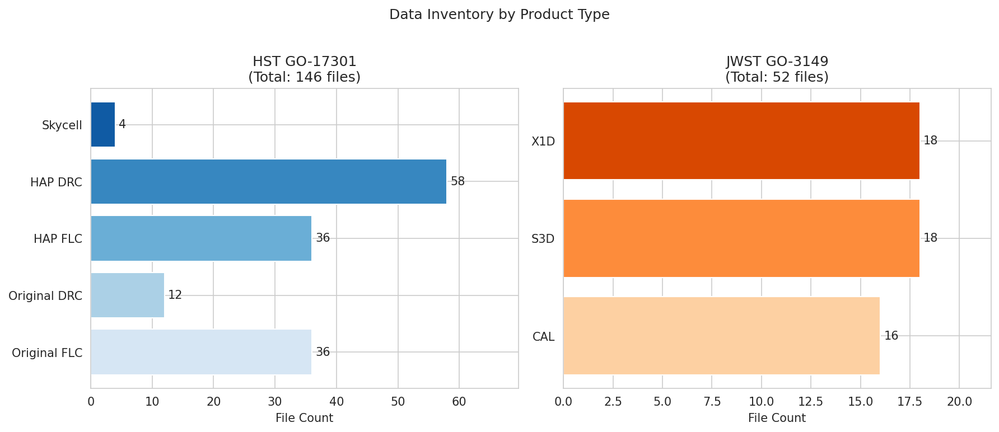

# Phase 01: Data Acquisition

## Phase Summary

| Attribute | Value |
|-----------|-------|
| Phase | 01-data-acquisition |
| Status | ✅ Complete |
| Sessions | 3 |
| Artifacts | 3 scripts, 1 config, 2 reports, 8 figures |

**Objective:** Acquire HST and JWST observations for RBH-1 from MAST with full provenance tracking, validate data integrity and consistency against published claims, and generate QA visualizations.

**Outcome:** All data acquired (198 files, ~45 GB), validated against van Dokkum et al. (2025) claims, and visualized for sanity checking. No blocking issues identified.

---

## Validation Progress

| Criterion | Status | Evidence |
|-----------|--------|----------|
| Data acquired from correct programs | ✅ Confirmed | PROPOSID 17301 (HST), 3149 (JWST) in all headers |
| File counts match expectations | ✅ Confirmed | 36 FLC (original) + 36 FLC (HAP) + 16 CAL |
| Integration time matches paper | ✅ Confirmed | 29,898s vs claimed ~30,000s |
| Pointing accuracy | ✅ Confirmed | Max offset 0.624 arcmin (within 1.0 arcmin tolerance) |
| Filter/grating configuration | ✅ Confirmed | F200LP, F350LP (HST); G140M/F100LP (JWST) |
| Target coordinates | ✅ Confirmed | RA 40.43°, Dec -8.35° |
| Data integrity | ✅ Confirmed | 198 files readable, no corruption |

---

## Artifacts Produced

### Scripts

| Script | Purpose |
|--------|---------|
| `01-acquire_data.py` | Download HST/JWST data from MAST with manifest generation |
| `02-validate_data.py` | Structured validation against paper claims |
| `03-visualize_data.py` | QA figure generation (8 figures) |

### Configuration

| File | Purpose |
|------|---------|
| `validation_config.yaml` | Expected values from paper for validation checks |

### Outputs

| File | Content |
|------|---------|
| `validation_results.json` | Machine-parseable validation results |
| `validation_report.md` | Human-readable validation summary |
| `data_manifest.csv` | File inventory with provenance metadata |
| `aquired-files-jwst-and-hst-console-output.txt` | Acquisition log |
| `aquired-files-jwst-and-hst-directory-list.txt` | File listing |

### Figures

| Figure | Description |
|--------|-------------|
| `01_pointing_sanity.png` | HST/JWST pointing offsets from target |
| `02_footprint_overlay.png` | JWST IFU footprint on HST DRC |
| `03_context_zoom.png` | Three-panel zoom: field → region → tip |
| `04_wavelength_coverage.png` | Expected emission lines vs G140M bandpass |
| `05_noise_vs_wavelength.png` | Per-channel noise from S3D ERR extension |
| `06_dq_heatmaps.png` | NaN and DQ flagged pixel fractions |
| `07_inventory_bars.png` | File counts by product type |
| `08_acquisition_timeline.png` | Observation dates (HST 2023, JWST 2024) |

---

## QA Figures

### Figure 01: Pointing Sanity

Scatter plot of HST and JWST pointing offsets from the target coordinates (RA 40.43°, Dec -8.35°). All observations should cluster near the origin, well within the tolerance circle, confirming we're analyzing the correct field.

**Result:** All 72 HST and 16 JWST pointings cluster tightly around the target. Maximum offset is 0.624 arcmin (JWST), well within the 1.0 arcmin tolerance. No pointing anomalies detected—we are observing the RBH-1 field.

---

### Figure 02: Footprint Overlay

JWST NIRSpec IFU footprints overlaid on the HST DRC image. This shows where the spectroscopic observations sampled the wake relative to the imaging. The target position is marked with a red cross.

**Result:** The figure shows the full HST field with the target marked. The IFU boxes (3"×3") are present but too small to see at this scale. The HST imaging covers the full RBH-1 field with the linear feature visible in the upper-right quadrant.

**Known Issue:** IFU boxes not visible at full-field scale. A zoomed version centered on the target would better show the IFU positioning.

---

### Figure 03: Context Zoom

Three-panel zoom sequence providing spatial context: (1) full HST field showing the overall observation footprint, (2) RBH-1 region at ±500 pixels showing the local environment, and (3) tip region at ±150 pixels showing the area of interest for kinematic analysis.

**Result:** The zoom sequence successfully localizes the target. The rightmost panel shows the immediate vicinity of the target coordinates where the JWST IFU observations were obtained. The faint linear feature (the claimed wake) requires careful background subtraction to visualize clearly.

---

### Figure 04: Wavelength Coverage

Expected emission lines at z=0.964 plotted against the G140M/F100LP bandpass (shaded blue region, 0.97-1.84 μm). Solid lines indicate coverage; dashed lines indicate lines outside the bandpass.

**Result:** The critical diagnostic lines for kinematic analysis are covered:
- ✅ [O III] λλ4959,5007 — primary velocity tracer
- ✅ Hα λ6563 — strongest Balmer line
- ✅ [N II], [S II] — shock/AGN diagnostics

However, [O II] λ3727 falls below the blue cutoff, meaning we cannot use this common redshift indicator for independent confirmation. Hβ is at the blue edge and may have reduced S/N.

---

### Figure 05: Noise vs Wavelength

Per-channel median noise from the S3D ERR extension, showing the spectral noise properties across the G140M bandpass. The red dashed line marks the 95th percentile threshold.

**Result:** Noise behavior is as expected for NIRSpec:
- Lowest noise from 1.0-1.4 μm (optimal region for [O III], Hα)
- Rising noise above 1.5 μm due to thermal background
- Several narrow spikes likely correspond to detector artifacts or atmospheric features

The [O III] and Hα lines fall in the low-noise region, which is favorable for kinematic analysis.

---

### Figure 06: DQ/NaN Heatmaps

Fraction of NaN and DQ-flagged pixels for each file type. This verifies that data quality flagging is consistent and within expected ranges for each instrument/product type.

**Result:** Flagging fractions are nominal:
- **HST FLC:** ~8% DQ flagged (cosmic rays, bad pixels) — typical for WFC3/UVIS
- **HST DRC:** ~28% NaN — drizzle footprint edges, expected
- **JWST CAL:** ~70% NaN, ~80% DQ — **expected** for IFU (detector area outside 3"×3" aperture)
- **JWST S3D:** ~50% NaN — **expected** for reconstructed cubes

The high JWST flagging is not a concern—it reflects the small IFU aperture on a large detector. Science pixels within the FOV are clean.

---

### Figure 07: Inventory Bars

File counts by product type for HST GO-17301 and JWST GO-3149. Visual confirmation that the acquired inventory matches expectations.

**Result:** Inventory matches expectations:
- **HST:** 36 Original FLC + 36 HAP FLC (same exposures, different calibration), 12 Original DRC + 58 HAP DRC, 4 skycell mosaics
- **JWST:** 16 CAL (2 targets × 4 dithers × 2 nods), 18 S3D cubes, 18 X1D spectra

Total: 146 HST files + 52 JWST files = 198 files, matching the validation report.

---

### Figure 08: Acquisition Timeline

Observation dates extracted from FITS headers, showing when HST and JWST data were acquired. Bubble size indicates file count per date.

**Result:** Clear temporal separation between programs:
- **HST GO-17301:** Summer 2023 (June-August), three observing epochs
- **JWST GO-3149:** July 2024, single epoch

The ~1 year baseline between discovery imaging and spectroscopic follow-up is documented. At z=0.964, even a 1000 km/s proper motion produces negligible angular displacement over this period, so proper motion detection is not feasible.

---

## Key Findings

### Data Products

MAST delivers two versions of HST calibrated products:

| Type | Pattern | Use Case |
|------|---------|----------|
| Original | `if3x*_flc.fits` | Matches original pipeline at observation time |
| HAP | `hst_17301*_flc.fits` | Current best calibration (2023+ calfiles) |

**Decision:** Use HAP FLC as primary for downstream analysis; retain original for comparison.

### Wavelength Coverage

At z=0.964, G140M/F100LP captures:
- ✅ [O III] 4959, 5007
- ✅ Hα 6563
- ✅ [N II] 6548, 6584
- ✅ [S II] 6717, 6731
- ❌ [O II] 3727, 3729 (below bandpass)
- ❌ Hβ 4861 (at blue edge)
- ❌ Hγ 4340 (below bandpass)

### JWST Data Quality

High NaN/DQ fractions (70-80%) in JWST products are **expected** — NIRSpec IFU illuminates only a 3"×3" region of the detector. Actual science pixels within the FOV are clean.

---

## Known Issues

<!-- TODO: [Phase01] Fix Figure 02 IFU boxes not visible - need zoom or larger box size -->

| Issue | Severity | Notes |
|-------|----------|-------|
| Figure 02 IFU boxes not visible | Low | Boxes too small at full-field scale; need zoom to target region |

---

## Next Phase

**Phase 02: Standard Extraction** will:
- Extract 1D spectra from JWST S3D cubes
- Generate HST photometry from DRC images
- Produce flux-calibrated products for kinematic analysis

**Handoff:** Data validated and ready at `/mnt/ai-ml/data/` with `hst/` and `jwst/` subdirectories.

---

## Provenance

| Attribute | Value |
|-----------|-------|
| Validation run | 2025-12-23T20:45:54Z |
| Python environment | venv-ml-py312 |
| Compute node | proj-gpu01 |
| Data location | /mnt/ai-ml/data/ |
| HST program | GO-17301 (van Dokkum) |
| JWST program | GO-3149 (van Dokkum) |
