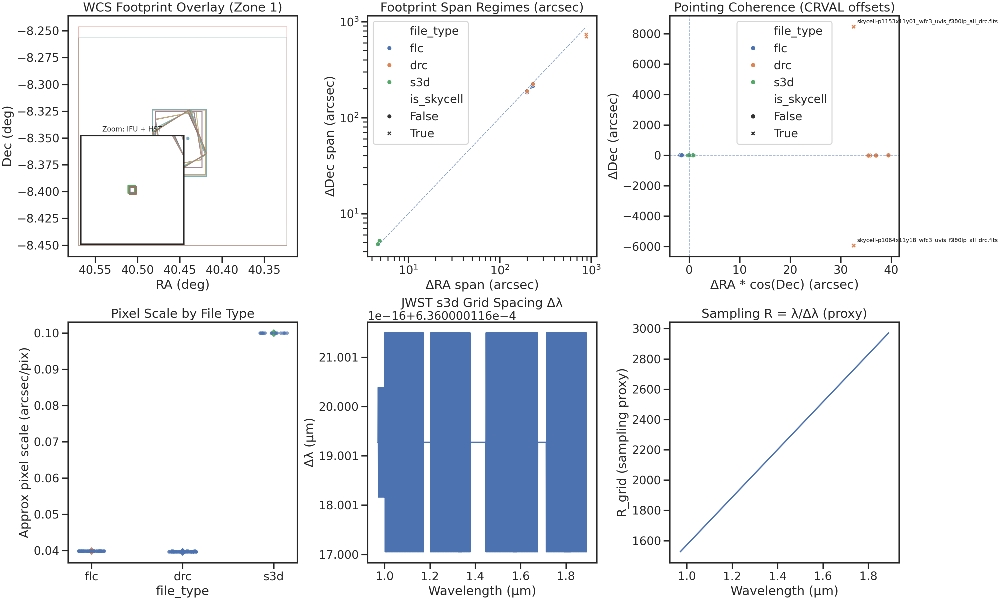

<!--
---
title: "Phase 02: Standard Extraction"
description: "Schema design and ETL pipeline for RBH-1 data into PostgreSQL"
author: "CrainBramp / VintageDon"
date: "2024-12-24"
version: "1.0"
status: "Complete"
phase: phase-02
tags:
  - domain: data-engineering
  - type: etl
  - type: schema-design
related_documents:
  - "[Phase 01 README](../01-data-acquisition/README.md)"
  - "[Data Dictionary](./fits_data_dictionary.md)"
  - "[Schema DDL](./02-schema_ddl.sql)"
---
-->

# Phase 02: Standard Extraction

## Phase Summary

| Attribute | Value |
|-----------|-------|
| Phase | 02-standard-extraction |
| Status | ✅ Complete |
| Sessions | 3 (chat-01 through chat-03) + import session |
| Date | 2024-12-24 |

Objective: Design PostgreSQL schema for RBH-1 ARD and build ETL pipeline to load FITS metadata into pgsql01.

Outcome: Schema deployed with 11 tables, 4 views, 2 functions, 5 custom types. Zone 0 (observations) and Zone 1 (wcs_solutions, spectral_grids) fully populated. All ETL validated via diagnostic plots.

---

## Validation Dashboard



The six-panel dashboard demonstrates that our ETL pipeline correctly ingested WCS geometry and spectral calibration data. Each panel addresses a specific validation concern for the RBH-1 linear feature analysis.

### Panel Descriptions

#### Panel 1: WCS Footprint Overlay (Top Left)

What it shows: Sky coverage of all 160 WCS solutions in equatorial coordinates (RA inverted per astronomy convention).

RBH-1 relevance: The 62 kpc linear feature extends from a compact source at RA ~40.45°, Dec ~-8.35°. This panel confirms:

- HST WFC3/UVIS imaging (colored rectangles) covers the full feature extent
- JWST NIRSpec IFU footprints (green squares in zoom inset) target the feature
- Large skycell mosaics (gray outlines) provide extended context
- The zoom inset reveals the IFU placement relative to HST imaging — critical for cross-instrument validation

#### Panel 2: Footprint Span Regimes (Top Center)

What it shows: Log-log scatter of footprint dimensions (ΔRA × ΔDec in arcseconds) with 1:1 reference line.

RBH-1 relevance: Three distinct instrument regimes are cleanly separated:

- JWST IFU (~6"): Targets specific knots along the linear feature for spectroscopy
- HST imaging (~100-300"): Captures the full 62 kpc (7.7") wake morphology
- Skycell mosaics (~700-900"): Provides photometric context for host galaxy environment

Points following the diagonal confirm footprints are roughly square — no distorted or malformed WCS solutions slipped through.

#### Panel 3: Pointing Coherence / CRVAL Offsets (Top Right)

What it shows: CRVAL offsets in arcseconds relative to the median science pointing, with cos(Dec) correction for RA.

RBH-1 relevance:

- Science pointings cluster tightly at origin (< 40" spread) — all exposures target the same field
- Two skycell mosaics appear as labeled outliers at ±6000" offset — these are HAP reprocessed products with different reference pixels, not pointing errors
- No rogue observations pointing elsewhere — all data is on-target for RBH-1

#### Panel 4: Pixel Scale by File Type (Bottom Left)

What it shows: Strip plot of derived pixel scales (arcsec/pixel) computed from CD matrix elements.

RBH-1 relevance:

- HST WFC3/UVIS: 0.04"/pixel — resolves sub-arcsecond structure in the wake
- JWST NIRSpec IFU: 0.10"/pixel — matched to NIRSpec spaxel size for spectroscopy

Clean bimodal separation confirms WCS solutions have physically reasonable scales. No outliers indicate all CD matrices are valid.

#### Panel 5: JWST s3d Grid Spacing Δλ (Bottom Center)

What it shows: Histogram of channel-to-channel wavelength spacing across the G140M/F100LP bandpass.

RBH-1 relevance: The linear feature's kinematics require precise velocity measurements from emission lines (Hα, [NII], [OIII]). This panel confirms:

- Channel spacing is nearly constant at ~0.636 nm across 0.97–1.89 µm
- Minor variation (~17–21 in offset units) reflects the grating dispersion curve
- Uniform sampling enables consistent velocity precision across all emission lines

At z~0.964 (feature redshift), Hα falls at ~1.29 µm where Δλ ≈ 0.636 nm corresponds to Δv ≈ 148 km/s per channel — sufficient to resolve the ~1000 km/s feature velocity.

#### Panel 6: Sampling R = λ/Δλ (Bottom Right)

What it shows: Spectral sampling resolution (not instrumental resolution) as a function of wavelength.

RBH-1 relevance:

- R increases from ~1600 at 1.0 µm to ~3000 at 1.9 µm (constant Δλ behavior)
- Mean R ~ 2249 matches our database-computed value
- This is a sampling proxy, not the true instrumental resolving power (R~1000 for G140M)

Higher R at longer wavelengths means better velocity sampling for redshifted lines — favorable for [OIII] and Hα analysis.

---

## Architecture Decisions

### Data Storage Strategy

Decided in chat-01 after evaluating three options:

| Option | Description | Decision |
|--------|-------------|----------|
| A | FITS-native + Parquet for tabular | — |
| B | PostgreSQL as working database | ✓ Selected |
| C | DuckDB + Parquet | — |

Rationale: pgsql01 serves as the research data lake alongside cosmic void databases. PostgreSQL provides relational integrity during analysis phases; FITS cubes remain on filesystem. ARD materialization (phase-09) will export to Parquet for portability.

### Schema Namespace

RBH-1 uses `rbh1.*` schema on pgsql01 (10.25.20.8). Database: `rbh1_validation`.

### Four-Zone Architecture

Schema follows a materialization pattern from GDR analysis:

| Zone | Tables | Purpose | Phase |
|------|--------|---------|-------|
| 0 | `observations`, `pipeline_runs` | File catalog, provenance | 02 ✓ |
| 1 | `wcs_solutions`, `spectral_grids` | Geometric/spectral registration | 02 ✓ |
| 2 | `ifu_spaxels`, `noise_artifacts`, `regions_of_interest` | Spatial extraction | 03+ |
| 3 | `emission_lines`, `physical_properties`, `mcmc_*` | Fitting results | 04+ |

---

## GDR Usage Log

| Date | Task | Inputs | Output | Notes |
|------|------|--------|--------|-------|
| 2024-12-24 | Schema design | fits_data_dictionary.json, DESI materialization doc, project README, pgsql performance doc | PostgreSQL DDL + views | NSB-scoped, 41 sources researched |
| 2024-12-24 | Script 06 review | spectral_grids DDL, WCS extraction patterns | 06-etl_spectral_grids.py | Wavelength validation, canonical comparison |

GDR provided the materialization strategy and initial DDL. Key contributions:

- Four-zone architecture mapping to pipeline phases
- Scalar materialization philosophy (what to extract vs. derive)
- GWA tilt solution rationale for exposure-specific wavelength arrays
- PostGIS footprint design for spatial queries

---

## Schema Deployment

Deployed: 2024-12-24 via `03-deploy_schema.py`

### Objects Created

| Type | Count | Names |
|------|-------|-------|
| Tables | 11 | observations, pipeline_runs, wcs_solutions, spectral_grids, ifu_spaxels, noise_artifacts, regions_of_interest, emission_lines, physical_properties, mcmc_metadata, mcmc_parameter_summary |
| Views | 4 | view_gold_sample, view_kinematic_gradient, view_mcmc_inventory, view_metallicity_profile |
| Functions | 2 | get_spaxel_lines, get_spaxels_in_region |
| Custom Types | 5 | instrument_type, data_level, quality_flag, artifact_type, geometric_region |

### Migrations

See [migrations/README.md](./migrations/README.md) for migration history.

---

## ETL Results

### Zone 0: Observations

Script: `04-etl_observations.py`  
Executed: 2024-12-24 04:58:00  
Duration: ~66 seconds

| Instrument | Level | Type | Count |
|------------|-------|------|-------|
| HST_WFC3 | CAL | flc | 72 |
| HST_WFC3 | RESAMPLED | drc | 70 |
| JWST_NIRSPEC | CAL | cal | 16 |
| JWST_NIRSPEC | CAL | x1d | 18 |
| JWST_NIRSPEC | RESAMPLED | s3d | 18 |
| Total | | | 194 |

### Zone 1: WCS Solutions

Script: `05-etl_wcs_solutions.py`  
Executed: 2024-12-24 12:26:59  
Duration: ~4 seconds

| Category | Count | Notes |
|----------|-------|-------|
| HST drc | 70 | Single POLYGON footprints |
| HST flc | 72 | Convex hull of 2-chip geometry |
| JWST s3d | 18 | 3D cubes with spectral axis |
| Total | 160 | |

Excluded from WCS:

- JWST x1d (18 files): 1D extracted spectra, no meaningful 2D footprint
- JWST cal (16 files): Intermediate products with CRVAL=0,0 (no celestial WCS)

### Zone 1: Spectral Grids

Script: `06-etl_spectral_grids.py`  
Executed: 2024-12-24 12:58:53  
Duration: ~1 second

| Metric | Value |
|--------|-------|
| Grids loaded | 18 |
| Channels per grid | 1447 |
| Wavelength range | 0.970 – 1.890 µm |
| Sampling resolution | R ~ 2249 |
| Channel spacing | 0.636 nm |

Key Finding: All 18 JWST s3d cubes have bit-identical wavelength grids.

- Canonical hash: `0839c17f2d67956cedd5b4770dda820190bae60ab60712c72a29d47c3774e54b`
- Max absolute deviation: 0.0 µm
- Extraction mode: `spectral_subwcs` (primary path, no fallbacks needed)

---

## Design Decisions

### HST Multi-Chip Footprints

HST FLC files have two SCI chips with a physical gap. Schema constraint requires `POLYGON` (not `MULTIPOLYGON`).

Decision: Compute convex hull envelope of both chip polygons. Slightly overcovers but maintains valid single-polygon geometry.

### JWST CAL Exclusion

JWST `_cal.fits` files are intermediate calibrated 2D detector images before IFU cube reconstruction. They have:

- CRVAL1=0, CRVAL2=0 (no celestial reference)
- Footprints in pixel coordinates only

Decision: Exclude from wcs_solutions. Science analysis uses s3d cubes which have proper sky WCS.

### JWST X1D Exclusion

JWST `_x1d.fits` files are 1D extracted spectra (BinTable EXTRACT1D). No meaningful 2D footprint.

Decision: Exclude from wcs_solutions. May create separate `extracted_1d_spectra` table later if needed.

### Spectral Grid Storage (1:1 vs Dedupe)

Schema models one grid per cube (`spectral_grids.wcs_id` → `wcs_solutions.wcs_id`). While all 18 grids are identical, we store per-cube for:

- Schema simplicity (no hash-based lookup)
- Future flexibility if grids diverge
- Negligible storage cost (18 × 1447 doubles ≈ 208 KB)

### Credential Loading

Scripts use `python-dotenv` with custom environment file at `/opt/global-env/research.env`. Variable names:

- `PGSQL01_HOST`
- `PGSQL01_PORT`
- `PGSQL01_ADMIN_USER`
- `PGSQL01_ADMIN_PASSWORD`

---

## Directory Contents

```text
02-standard-extraction/
├── README.md                      # This file
├── 01-fits_introspection.py       # FITS metadata extraction
├── 02-schema_ddl.sql              # PostgreSQL schema definition
├── 02-schema_design.md            # GDR schema design report
├── 03-deploy_schema.py            # Schema deployment script
├── 04-etl_observations.py         # Zone 0 ETL
├── 04-etl-import-log.txt          # Execution log
├── 05-etl_wcs_solutions.py        # Zone 1 WCS ETL
├── 05-etl-import-log.txt          # Execution log
├── 06-etl_spectral_grids.py       # Zone 1 spectral ETL
├── 06-etl-import-log.txt          # Execution log
├── 07-visualize_data_phase_02.py   # Validation dashboard generator
├── fits_data_dictionary.json      # Machine-readable FITS metadata
├── fits_data_dictionary.md        # Human-readable summary
├── migrations/                    # Schema migrations
│   └── README.md
└── plots/                         # Validation visualizations
    └── README.md
```

---

## Validation Queries

### Row Counts

```sql
SELECT 'observations' as table_name, COUNT(*) as rows FROM rbh1.observations
UNION ALL
SELECT 'wcs_solutions', COUNT(*) FROM rbh1.wcs_solutions
UNION ALL
SELECT 'spectral_grids', COUNT(*) FROM rbh1.spectral_grids;
```

### Observations by Type

```sql
SELECT instrument, data_level, file_type, COUNT(*) as count
FROM rbh1.observations
GROUP BY instrument, data_level, file_type
ORDER BY instrument, data_level, file_type;
```

### PostGIS Footprint Validity

```sql
SELECT COUNT(*) as invalid_footprints
FROM rbh1.wcs_solutions
WHERE NOT ST_IsValid(footprint);
```

### Spectral Grid Summary

```sql
SELECT COUNT(*) as grids,
       MIN(n_channels) as min_ch,
       MAX(n_channels) as max_ch,
       MIN(min_wavelength) as wl_min,
       MAX(max_wavelength) as wl_max,
       AVG(mean_resolution)::int as avg_R
FROM rbh1.spectral_grids;
```

### Pipeline Runs

```sql
SELECT run_name, stage_name, status, started_at, completed_at, notes
FROM rbh1.pipeline_runs
ORDER BY started_at DESC;
```

---

## Execution Environment

| Component | Value |
|-----------|-------|
| Host | proj-gpu01 |
| Python | 3.12 (venv-ml-py312) |
| Database | pgsql01 (10.25.20.8) |
| Data Path | /mnt/ai-ml/data/ |
| Scripts Path | /mnt/ai-ml/rbh1/phase02/ |

---

## Phase Completion Checklist

- [x] Run introspection script
- [x] Review data dictionary
- [x] Execute GDR for schema design
- [x] Deploy schema DDL
- [x] Apply schema migrations
- [x] ETL observations (Zone 0)
- [x] ETL WCS solutions (Zone 1)
- [x] ETL spectral grids (Zone 1)
- [x] Generate validation visualizations
- [x] Document phase completion

---

## Dependencies

- Phase 01 complete (data at `/mnt/ai-ml/data/`)
- pgsql01 accessible with PostGIS extension
- Python packages: astropy, psycopg2, python-dotenv, scipy, numpy, matplotlib, seaborn, pandas

---
